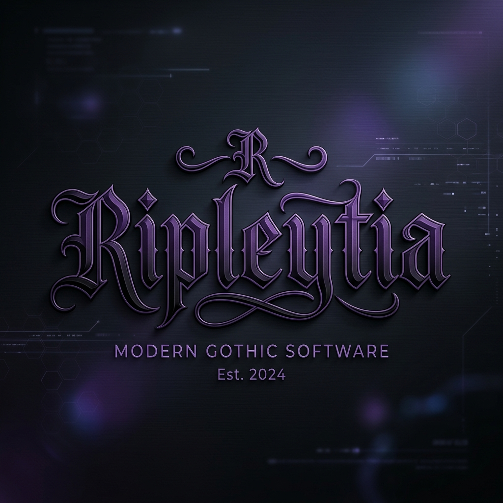
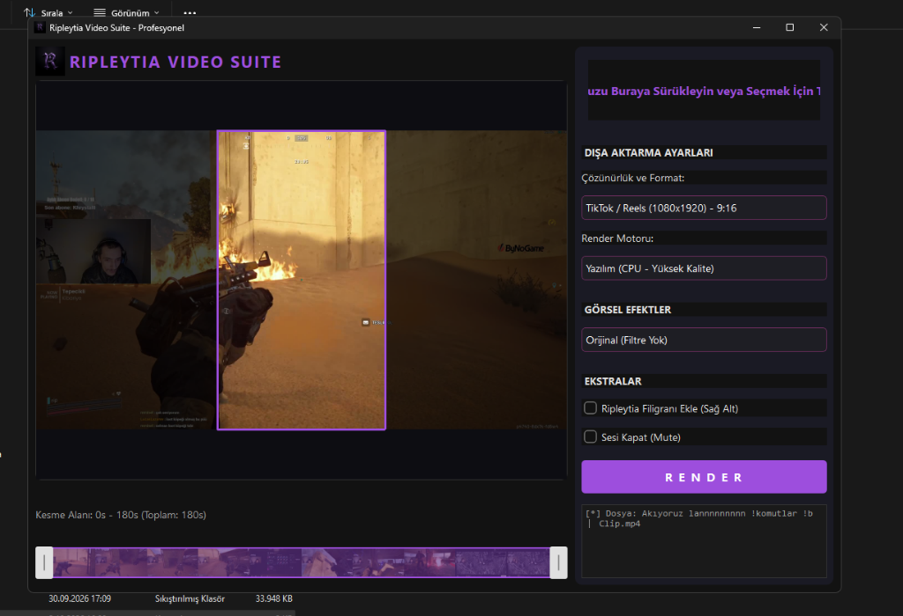
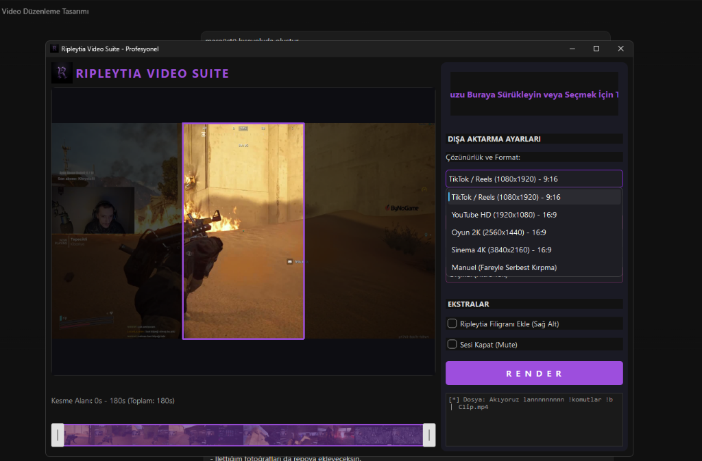

<div align="center">
  
  
  # Ripleytia Video Suite (V1 BETA)
  **Profesyonel, Donanım Hızlandırmalı ve Estetik Video Düzenleme Altyapısı**
</div>

---

## 📌 Proje Hakkında
**Ripleytia Video Suite**, gelecekte devasa bir Kurgu (NLE - Non-Linear Editor) yazılımına dönüşmek üzere tasarlanmış, PyQt6 ve FFmpeg tabanlı son derece güçlü bir video düzenleme programıdır. 

Sıradan "video dönüştürücülerden" farklı olarak; donanım hızlandırma (NVENC/AMF), asenkron iş parçacıkları (QThread), anlık görsel önizleme, manuel kırpma ve film şeridi (timeline) gibi profesyonel araçları barındırır. Uygulamanın arayüzü özel "Gothic Mor" temasıyla tasarlanmış olup şık, karanlık ve modern bir kullanıcı deneyimi sunar.

## ✨ Temel Özellikler
* 🚀 **Gelişmiş Render Motoru:** NVIDIA NVENC ve AMD AMF donanım hızlandırma destekli FFmpeg entegrasyonu (Süreç CPU'yu yormadan 10 kata kadar daha hızlı tamamlanır).
* 🎞️ **Film Şeridi (Timeline) Kesme Aracı:** Videoyu yüklediğiniz anda FFmpeg arka planda saniyeler içinde 10 adet kare çeker ve özel tasarlanmış Timeline'a film şeridi olarak dizer. Hangi saniyeyi kestiğinizi görsel olarak görebilirsiniz.
* 📐 **Otomatik ve Manuel Boyutlandırma:** 
  * Hazır şablonlarla (TikTok 9:16, YouTube 16:9, Oyun 2K, Sinema 4K) tek tıkla profesyonel boyutlandırma. Siyah barlar oluşmaz; **"Crop-to-Fill" (Tam Ekran Doldurma)** mantığıyla videonun merkezi alınarak dışarı taşan alanlar kusursuzca kesilir.
  * **Manuel Serbest Kırpma:** Farenizle önizleme ekranına dikdörtgen çizerek videonun sadece o bölgesini kesip alabilirsiniz (Crop). Önizleme ekranı, videonun neresinin kesileceğini simüle eder.
* 🎨 **Görsel Efektler ve Renk Filtreleri:** Sinematik (Kontrast+), Canlı (Doygunluk+), Matrix (Soğuk), Güneşli (Sıcak), Bulanık (Glow), Siyah Beyaz ve Vintage (Sepya) gibi tek tıkla uygulanabilir `colorchannelmixer` tabanlı donanımsal renk filtreleri.
* 🛡️ **Profesyonel Ekstralar:** Çıktılarınıza anında Ripleytia Filigranı (Sağ Alt Köşe) ekleyebilir veya videonun sesini (`-an` parametresi ile) tamamen kapatabilirsiniz.

## 📸 Ekran Görüntüleri

<div align="center">
  
  <br/><br/>
  
</div>

## 🛠️ Kurulum ve Çalıştırma

### Geliştirici Ortamı (Python)
Eğer projeyi geliştirmeye devam etmek veya kaynak kodundan çalıştırmak isterseniz:
1. Repoyu bilgisayarınıza klonlayın:
   ```bash
   git clone https://github.com/ripleytia/VideoEditTool-V1-BETA.git
   cd VideoEditTool-V1-BETA
   ```
2. Gerekli kütüphaneleri yükleyin:
   ```bash
   pip install -r requirements.txt
   ```
3. Uygulamayı başlatın:
   ```bash
   python main.py
   ```

### 📦 Taşınabilir Sürüm (Stand-alone .exe Oluşturma)
Projeyi Python gerektirmeyen bağımsız bir Windows programı haline getirmek için klasörün içindeki `build.ps1` betiğini sağ tıklayıp PowerShell ile çalıştırabilirsiniz. Bu işlem PyInstaller kullanarak `dist/RipleytiaVideoSuite` klasöründe bir `.exe` üretecektir.

*NOT: Arka plan video işlemleri için sisteminizde FFmpeg kurulu olmalı veya `ffmpeg.exe` dosyası uygulamanın dizininde bulunmalıdır.*

## 🏗️ Mimari (Architecture)
Bu proje, gelecekte eklenebilecek yüzlerce özelliğe hazır olacak şekilde **MVC** mantığı ile modüler tasarlanmıştır:
* `main.py`: Giriş noktası ve sinyal/olay yöneticisi.
* `ui/`: Kullanıcı arayüzü bileşenleri (`main_window.py`, `preview_widget.py`, `custom_widgets.py`).
* `core/`: Kullanıcı arayüzünü dondurmayan, arka planda çalışan Asenkron Thread motorları (`ffmpeg_handler.py`, `thumbnail_extractor.py`).
* `utils.py`: PyInstaller'ın geçici klasör sorunlarını aşmak için yazılmış özel dosya yolu kütüphanesi.

---
<div align="center">
  <br/>
  <i>Ripleytia tarafından, profesyoneller için geliştirilmiştir.</i>
</div>
